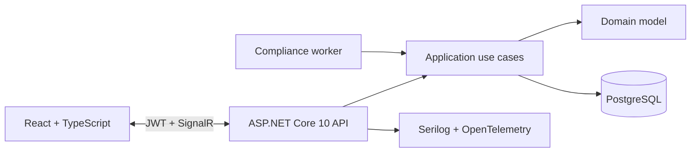

# CareOps

**Real-time provider credentialing, compliance, and coverage operations—built as a production-minded .NET full-stack portfolio project.**

CareOps gives healthcare workforce teams one place to move providers from intake to approval, watch expiring credentials and SLA risk, coordinate coverage shifts, and retain an audit-ready decision trail. The repository demonstrates modern C#/.NET engineering across domain modeling, secure APIs, PostgreSQL persistence, background work, realtime updates, React, automated testing, containers, and CI.

> This is synthetic portfolio software, not a certified medical or credentialing system. It contains no real provider documents or protected health information.

## What this project proves

- A guarded workflow state machine for `Draft → Submitted → UnderReview → NeedsInformation → Approved → Suspended / Expired`, with invalid transitions rejected in the domain layer.
- ASP.NET Core Identity, short-lived JWTs, lockout, and distinct provider, credentialing specialist, manager, and administrator authorization boundaries.
- EF Core 10 + PostgreSQL with a committed migration, indexed queue projections, optimistic concurrency, retries, and deterministic demo seeding.
- An idempotent compliance worker for 30/7-day expiration alerts, SLA escalation, automatic expiry, and retry-safe deduplication.
- SignalR workflow, notification, and shift events consumed by a responsive React 19 + TypeScript operations UI.
- Metadata-only credential handling with filename normalization, content-type/size validation, SHA-256 integrity fields, and opaque storage keys.
- xUnit + FluentAssertions domain coverage and HTTP tests against real PostgreSQL using Testcontainers.
- A non-root multi-stage container, Docker Compose health checks, locked dependencies, OpenAPI, Serilog, OpenTelemetry, and GitHub Actions.

## Architecture at a glance



The backend is a modular monolith: one reliable transaction boundary, explicit inward dependencies, and extraction seams without premature distributed-system cost. See [the architecture guide](docs/architecture.md) and the [ADRs](docs/adr).

## Run it

Prerequisites: Docker Desktop or Docker Engine with Compose.

```bash
git clone <your-repository-url>
cd careops
cp .env.example .env        # PowerShell: Copy-Item .env.example .env
docker compose up --build
```

Open [http://localhost:5080](http://localhost:5080). PostgreSQL is exposed on host port `5433` for local inspection (override `POSTGRES_PORT` if needed). The API applies the committed migration and adds synthetic seed data on first Development startup.

### Demo personas

All demo users use `CareOps-Demo-2026!`. These are obvious local-only credentials and are never enabled by the Production environment.

| Persona | Email | Capabilities |
|---|---|---|
| Provider | `maya.chen@careops.local` | Own profile, credentials, comments, offered shifts |
| Specialist | `specialist@careops.local` | Queues, checks, credential reviews, information requests |
| Manager | `manager@careops.local` | Specialist access plus approval and suspension |
| Administrator | `admin@careops.local` | Full workflow access and manual compliance scan |

Six synthetic providers cover draft, submitted, review, needs-information, approved, and suspended scenarios. One approved provider has an offered coverage shift.

## Local development without the app container

Use Compose for PostgreSQL, then run the API and Vite separately:

```bash
docker compose up -d postgres
dotnet tool restore
dotnet run --project src/CareOps.Api

# second terminal
cd src/CareOps.Web
npm ci
npm run dev
```

Vite runs at `http://localhost:5173` and proxies API and SignalR traffic to `http://localhost:5080`. .NET 10 SDK feature band `10.0.400` is recorded in `global.json`; compatible later 10.0 feature bands can roll forward.

## Product capabilities

### Credentialing workspace

- SLA-prioritized and paginated provider queue with status, reviewer, name, and NPI filters.
- Provider drill-down for credential metadata, primary-source checklist evidence, internal/provider-visible comments, and audit history.
- Credential verification/rejection and required-check completion before approval is permitted.
- Manager-only approval/suspension and provider ownership checks inside application use cases, not only endpoint attributes.

### Compliance operations

- KPI dashboard for active reviews, SLA risk, credentials expiring within 30 days, workflow distribution, and compliance rate.
- Hourly expiration and escalation scan with persisted notification dedupe keys.
- Health endpoints split into process liveness and PostgreSQL-backed readiness.
- Realtime queue refresh through authenticated SignalR connections and automatic reconnect.

### Scheduling

- Open, offered, confirmed, and cancelled coverage shift lifecycle.
- Only approved providers can be offered a shift; only the offered provider can confirm it.
- Operations schedule view and provider-specific upcoming coverage.

## Repository map

```text
src/
  CareOps.Domain/          aggregates, workflow and scheduling invariants
  CareOps.Application/     use cases, projections, DTOs, validators, interfaces
  CareOps.Infrastructure/  EF Core, Identity/JWT, SignalR, jobs, seed data
  CareOps.Api/             minimal API endpoints, middleware, telemetry, SPA host
  CareOps.Web/             React + TypeScript + Vite client
tests/
  CareOps.Domain.Tests/    fast state-machine and scheduling tests
  CareOps.Api.IntegrationTests/ real PostgreSQL HTTP/authorization tests
docs/                      architecture, milestones, ADRs, performance plan
http/                      runnable API request examples
scripts/                   k6 load scenario
```

## API surface

OpenAPI JSON is available at `/openapi/v1.json`. Runnable examples live in [`http/CareOps.Api.http`](http/CareOps.Api.http).

| Area | Representative endpoints |
|---|---|
| Auth | `POST /api/auth/login`, `POST /api/auth/register/provider`, `GET /api/auth/me` |
| Credentialing | `GET /api/providers`, `GET /api/providers/{id}`, `POST /submit`, `POST /transition` |
| Verification | `POST /credentials/{id}/review`, `PUT /checklist/{id}`, `POST /comments` |
| Operations | `GET /api/dashboard`, `POST /api/dashboard/run-compliance-scan` |
| Scheduling | `GET/POST /api/schedule/shifts`, `POST /shifts/{id}/confirm` |
| Realtime | `/hubs/workflow` |

Errors use RFC 9457-style problem details with a trace identifier. FluentValidation returns field-level `400` responses; domain conflicts return `409`; ownership/policy failures return `403`.

## Build and test

```bash
dotnet restore CareOps.sln --locked-mode
dotnet build CareOps.sln -c Release --no-restore
dotnet test CareOps.sln -c Release --no-build

cd src/CareOps.Web
npm ci
npm run lint
npm run build
```

Integration tests require a running Docker daemon; Testcontainers creates and disposes an isolated PostgreSQL 17 instance. Generate an idempotent deployment script with:

```bash
dotnet tool restore
dotnet ef migrations script --idempotent --project src/CareOps.Infrastructure --startup-project src/CareOps.Api
```

## Security decisions

- No real secrets belong in Git. Production startup fails if a JWT signing key is not supplied. `.env`, local appsettings, certificates, and common secret files are ignored.
- The Compose defaults and Development password are deliberately labeled local demo values. Replace them before any shared deployment.
- Providers are self-registerable only into the `Provider` role; privileged role assignment is not exposed over HTTP.
- Credential binaries are out of scope for the demo. A production adapter should use private object storage, presigned uploads, encryption, malware scanning, retention policy, and download audit logging.
- The SPA stores the demo access token in local storage for a transparent portfolio flow. A public production deployment should prefer a backend-for-frontend with secure, HTTP-only cookies and CSRF protection.

See [SECURITY.md](SECURITY.md) for responsible reporting and the production hardening list.

## Observability, performance, and reliability

Serilog emits structured request and application logs. OpenTelemetry captures ASP.NET Core and outbound HTTP traces plus ASP.NET Core, HTTP client, and runtime metrics; set `OpenTelemetry__OtlpEndpoint` to export OTLP.

The [performance plan](docs/performance.md) records honest measurement context and thresholds. Run the included k6 scenario after Compose is healthy:

```bash
docker run --rm -e BASE_URL=http://host.docker.internal:5080 \
  -v "$PWD/scripts:/scripts" grafana/k6:latest run /scripts/load-test.js
```

The observed local Compose baseline sustained **39.00 requests/second** across 20 concurrent users at **43.38 ms combined p95** with **0.00% failures**. The performance record includes the image digest, host context, endpoint-specific timings, and scope caveats; rerun it on the published commit before turning it into a resume claim.

## Explicit production gaps

This MVP is realistic, but it does not disguise portfolio scope as certification:

- Add an outbox and durable email/SMS delivery for notification side effects.
- Add a distributed lease before running the compliance worker in multiple replicas.
- Replace demo metadata storage with an encrypted object-storage adapter and malware/DLP pipeline.
- Add refresh-token rotation or a cookie-based BFF, MFA, external identity federation, and administrative user provisioning.
- Add field-level authorization/tenant boundaries, formal data retention, backup restoration tests, and healthcare compliance review.
- Expand scheduling with availability, conflict detection, credential-at-shift-time checks, and facility rules.

## Engineering records

- [Milestone plan](docs/milestones.md)
- [Architecture and runtime flows](docs/architecture.md)
- [ADR 001: Modular monolith](docs/adr/001-modular-monolith.md)
- [ADR 002: Credential metadata](docs/adr/002-file-metadata.md)
- [ADR 003: Idempotent compliance worker](docs/adr/003-compliance-worker.md)
- [Performance measurement](docs/performance.md)

## License

MIT. See [LICENSE](LICENSE).
