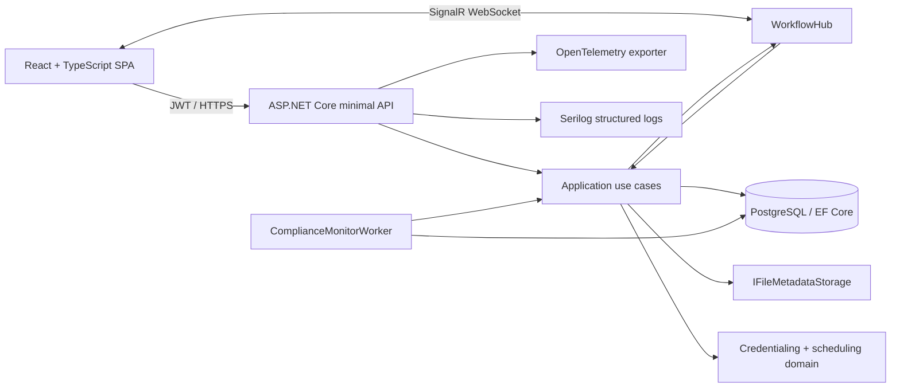

# CareOps architecture

CareOps is a modular monolith. Credentialing, compliance, scheduling, and identity share one deployable boundary and one PostgreSQL transaction boundary, while code dependencies point inward toward the domain. This is intentionally operationally simple for the MVP and leaves seams for later extraction.

## Dependency boundaries

| Project | Responsibility | Depends on |
|---|---|---|
| `CareOps.Domain` | Aggregates, state transitions, scheduling rules, audit entities | Nothing |
| `CareOps.Application` | Use cases, DTOs, validators, persistence/realtime/file abstractions | Domain, EF abstractions, FluentValidation |
| `CareOps.Infrastructure` | PostgreSQL, Identity, JWT, SignalR, background processing, demo seeding | Application, Domain |
| `CareOps.Api` | HTTP composition, authorization policies, endpoints, problem details, telemetry | All backend projects |
| `CareOps.Web` | Operations dashboard and provider workspace | Published API contract |

## Runtime flows

1. A provider registers or signs in and receives a short-lived, role-bearing JWT.
2. Profile commands load the aggregate with credentials, checklist, comments, and audit history.
3. Domain methods enforce transition and approval invariants before EF commits atomically.
4. The notifier publishes the committed state through SignalR; clients refresh their read models.
5. The compliance worker scans hourly, creates notifications with unique deduplication keys, escalates breached SLAs, and expires approved profiles whose credentials elapsed.

## Data and security boundaries

- Identity passwords are one-way hashed by ASP.NET Core Identity. Five failed logins trigger lockout.
- JWT signing material is read from configuration providers and must be injected in non-development environments.
- Credential rows contain metadata and an opaque storage key only. Original file paths are stripped, hashes are validated, size/type are allow-listed, and no clinical or credential binary is committed.
- PostgreSQL `xmin` is used as an optimistic concurrency token for provider profiles.
- Provider users may read/change only the profile tied to their user ID. Operations roles can access queues; approval and suspension additionally require manager or administrator.
- Audit events are append-only through the aggregate API. The application exposes a provider-safe subset to provider users.
